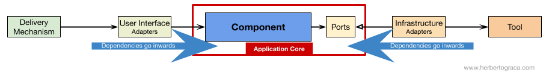

# Hexagonal template project

This project is a template of rest service configured in Hexagonal way.

It includes "standard" libraries for a modern project.

The goal of this architecture is to divide the project in different part and have a weak coupled between the business and other modules.

This project include examples to define where the components should be located.

If you want to change the technologies used to make components, it is ok.

> Keep in mind that every module except domain module should be deleteable.

you can find an interesting article on hexagonal architecture here : https://blog.octo.com/architecture-hexagonale-trois-principes-et-un-exemple-dimplementation/

An another excellent article : https://herbertograca.com/2017/11/16/explicit-architecture-01-ddd-hexagonal-onion-clean-cqrs-how-i-put-it-all-together/

## Composition

the project will be divided in 3 modules :
* application : Contains the launcher of the application and the interface with external world (rest service)
* infrastructure : Contains all components that call external world
* domain : Contains the business of the application and contract to be implemented by infrastructure module

### Application module

application define :
* global exception handler : Component that handle exceptions of the application and transform them with the actual convention.
* spring security config (service) : The securization of the presentation layer
* mapstruct : Classes used to map swagger objects with business objects.
* spring config : an application config for all modules
* actuator configured on another port : An actuator configured on an another port to create a new thread pool to manage liveness, readiness, prometheus, ... without impact the application business.
* actuator health check : The health check is managed by prometheus
* prometheus registry config : the configuration to give the application observable by prometheus
* prometheus endpoint : An endpoint auto-generate by spring boot
* ...

infrastructure define :
* spring security config (client) : A configuration to call external service secured with oauth
* spring data jpa interface : Can be replaced by another technology like jdbctemplate
* repository class that implements domain repository interface : An implementation of the contract defined in domain module
* ...

domain define :
* business dto : the application business objects
* service interface and implementation : the business service
* business repository interface : A contract call by the domain module that infrastructure module must respect
* transaction management : Transaction management configuration
* ...
